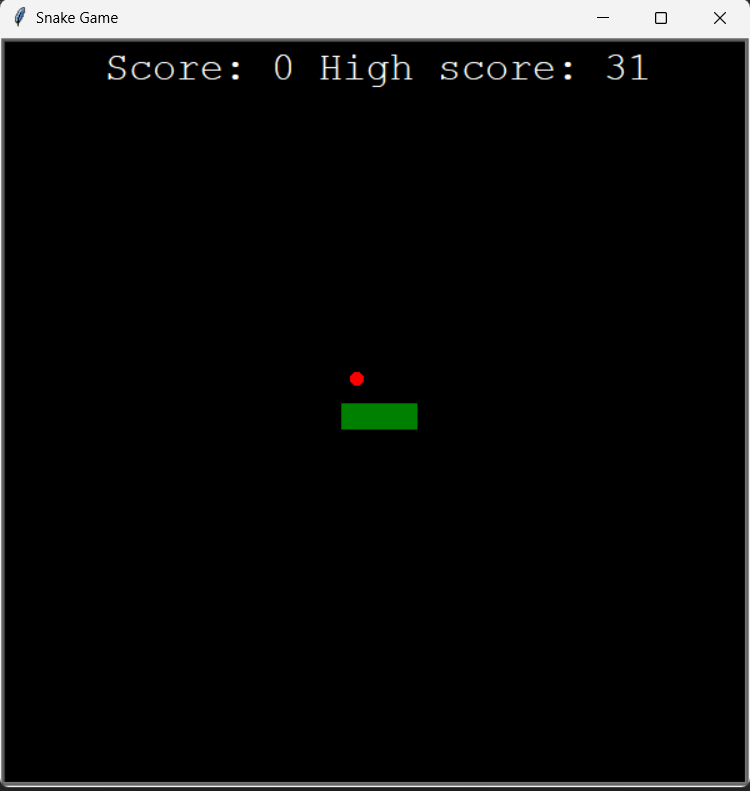

# Snake_Game 🐍

 

Basic Snake Game developed in python with the Turtle library.

This project was one of the first projects I developed while learning Python. It helped me a lot when I was struggling to understand some concepts of Object Oriented Programming.

 

Jogo da Cobrinha básico desenvolvido em python utilizando a biblioteca Turtle.

Este projeto foi um dos primeiros projetos que desenvolvi enquanto aprendia Python. O projeto me ajudou muito quando eu estava tendo dificuldades para aprender alguns conceitos da Programação Orientada a Objeto.

